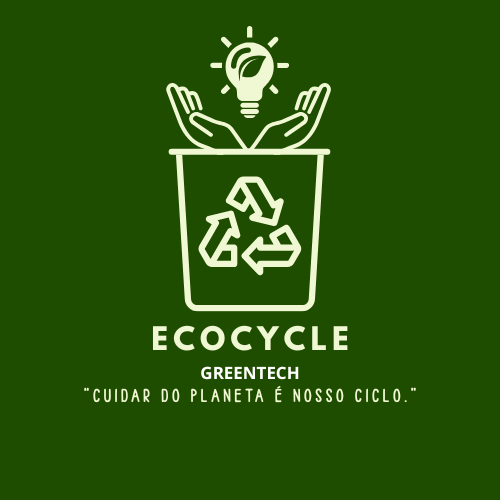

# ♻️ Projeto EcoCycle.

**𝗢 𝗥𝗘𝗔𝗗𝗠𝗘 𝗢𝗙𝗜𝗖𝗜𝗔𝗟 𝗗𝗢 𝗦𝗜𝗧𝗘 𝗗𝗔 𝗘𝗖𝗢𝗖𝗬𝗖𝗟𝗘!**

Sejam todos muito bem-vindos ao README de nosso site da EcoCycle, que também envolve nosso projeto de sustentabilidade, este site foi criado com o propósito de auxiliar no entendimento dele, e implementar um sistema de MVC, além de fazer parte de um processo educacional graças à rede SENAI, para desenvolver e aplicar nossas habilidades em um projeto real que busca facilitar o acesso e uso de uma reciclagem automática com o uso da tecnologia. Durante o desenvolvimento da EcoCycle, estamos aperfeiçoando diversas competências essenciais, como:

• Trabalho em equipe e colaboração;

• Criatividade e inovação;

• Capacidade de resolver problemas reais;

• Desenvolvimento de habilidades em: JS, HTML, BootStrap, Figma, e principalmente MVC.

**🖌️ Sinta-se livre para analisar nossa estrutura! ⇨**
[Figma](https://www.figma.com/design/QDa3CdHiIvSrTi8CQIYJva/EcoCycle?node-id=293-61&t=f75zvO56LtMKksZn-0)

---

## 🎯 Objetivo do Projeto 📌

O nosso projeto EcoCycle tem como principal objetivo facilitar as formas de reciclagens e produção, para assim se tornarem mais sustentáveis. Nós buscamos reaproveitar recursos e diminuir a emissão de poluentes. Este site também apresenta um sistema de MVC, para deixar o entendimento de nosso projeto de forma mais clara e objetiva.

Nosso foco está em criar uma máquina que faz a triagem automática de lixos recicláveis e orgânicos, e com o MVC será possível organizar tudo de forma mais fácil além de mostrar, por exemplo, todo o processo que ocorre com os produtos reciclados ou tratados. Tudo dentro de uma plataforma moderna, funcional e pensada para todos.

**💪 Você pode ver todo o processo desafiador que nossa equipe passou para desenvolver as funcionalidades do site aqui** ⇨ [Clickup](https://app.clickup.com/9013984720/v/l/6-901309792828-1?pr=90134050405)

---

## ⚡ Os Grandes Problemas Ambientais

Atualmente, milhares de cidades sofrem com o descarte incorreto de resíduos, um problema que vem crescendo significativamente com o passar dos anos. Entre os principais impactos estão: poluição do solo e da água, acúmulo de lixo em áreas urbanas, aumento do descarte irregular, desperdício de materiais recicláveis, enchentes causadas por bueiros entupidos e riscos à saúde da população.

Muitas pessoas e empresas enfrentam esses desafios sem suporte adequado, seja por falta de informação, acesso, tempo, incentivo ou até mesmo por não saberem como descartar corretamente seus resíduos.

---

## 💡O Que a EcoCycle oferece Para Ajudar 🌳

A EcoCycle foi criada com o objetivo de facilitar o descarte correto de resíduos e incentivar práticas mais sustentáveis no dia a dia da população. Por meio da informação e da conscientização, a EcoCycle oferece:

Identificação inteligente de resíduos: O sistema orienta o usuário sobre como e onde descartar corretamente cada tipo de material.

🌐 Acessibilidade: Interface pensada para todos os públicos.

🔒 Compromisso com a responsabilidade ambiental: Foco total na redução de impactos ao meio ambiente e na valorização da reciclagem.

🔒 Segurança dos dados: Proteção e privacidade garantidas para todos os usuários.

😁 Possibilidades de tornar o descarte consciente algo simples, acessível e parte da rotina de todos.

---

## 🛠️ Tecnologias Utilizadas
Este projeto foi desenvolvido com:

- Visual Studio 2022
- Códigos em JS
- Estrutura semântica no **Figma** e **HTML5**
- Estilização com **Bootstrap**
- Layouts responsivos para diferentes tamanhos de tela
- Organização visual e intuitiva para o usuário

---

# 💥 Veja Nosso Site Completo 🔥
Você pode ver como ficou nosso site completo aqui!
[EcoCycle](https://michelacre.github.io/PsyquIA/)
---

## 📋 Feedback

Se você tiver algum feedback, por favor nos deixe saber!

Nosso Email para contatos é: EcoCycle@gmail.com

Sua opinião é de extrema importância e nos motiva a melhorar cada vez mais ❤️

---

## 🚀 Conheça os Devs e Orientadores! 🤝

- [@EnzoNicoletti](https://github.com/EnzoNicoletti)

- [@MichelAcre](https://github.com/MichelAcre)

- [@biel-365](https://github.com/biel-365)

- [@Luan-Galera](https://github.com/Luan-Galera)

**Orientadores:**

- [@ProfCastello](https://github.com/ProfCastello)
- [@ProfCristianoDePaula](https://www.github.com/ProfCristianoDePaula)

---

#EcoCycle #Reciclagem #SENAI #ProblemasAmbientais #Site #Projeto
